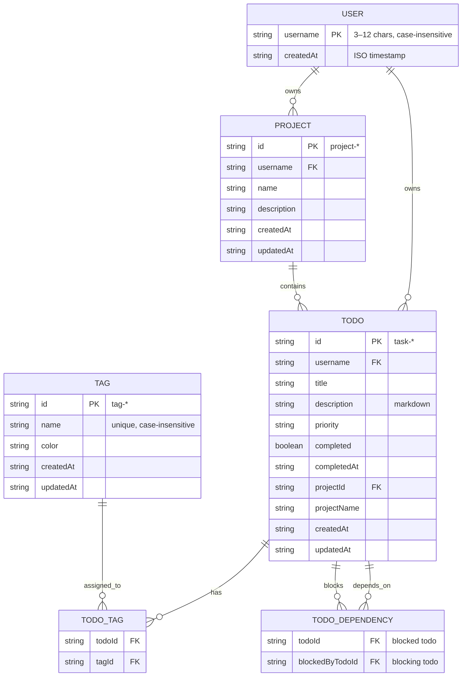

# Todo List MCP Server

A Model Context Protocol (MCP) server that provides a comprehensive API for managing todo items. This is the fork that expands on lots of features. Focusing mainly on more efficient context management while still maintaining the required features of a task management platform.

## Features

- **User authentication**: Automatic user registration with username-based access control
- **Create todos**: Add new tasks with title and markdown description
- **Update todos**: Modify existing tasks
- **Complete todos**: Mark tasks as done
- **Delete todos**: Remove tasks from the list
- **Search todos**: Find tasks by title, date, or priority
- **Summarize todos**: Get a quick overview of active tasks
- **Tag management**: Organize todos with custom tags and colors (shared across all users)
- **Task dependencies**: Mark tasks as blocked by other tasks (blocked_by relationships)
- **Projects**: Organize related tasks into projects (each task belongs to at most one project)
- **Tag limit**: Maximum of 4 tags per todo enforced

## Tools

This MCP server exposes the following tools:

### User Management

1. `list-users`: List all registered users

### Todo Management

2. `create-todo`: Create a new todo item (requires username)
3. `list-todos`: List all todos for a user (requires username)
4. `get-todo`: Get a specific todo by ID (requires username)
5. `update-todo`: Update a todo's title or description (requires username)
6. `complete-todo`: Mark a todo as completed (requires username)
7. `delete-todo`: Delete a todo (requires username)
8. `search-todos-by-title`: Search todos by title (case-insensitive partial match, requires username)
9. `search-todos-by-date`: Search todos by creation date (format: YYYY-MM-DD, requires username)
10. `search-todos-by-priority`: Search todos by priority level (requires username)
11. ~~`list-active-todos`: List all non-completed todos for a user (requires username)~~ **(merged with list-todos)**
12. ~~`summarize-active-todos`: Generate a summary of all active (non-completed) todos (requires username)~~ **(merged with list-todos)**

### Tag Management

13. `create-tag`: Create a new tag with optional color (validates if tag already exists)
14. `list-tags`: List all available tags (shared across all users)
15. ~~`get-tag`: Get a specific tag by ID~~ (batching is by default)
16. `get-tags`: Get multiple tags by IDs (batch operation for efficiency)
17. `update-tag`: Update a tag's name or color
18. `delete-tag`: Delete a tag (removes from all todos)
19. `search-tags`: Search tags by name
20. `add-tag-to-todo`: Assign a tag to a todo
21. `remove-tag-from-todo`: Remove a tag from a todo
22. `get-todo-tags`: Get all tags assigned to a todo
23. `search-todos-by-tag`: Find all todos with a specific tag

### Task Dependencies (blocked_by)

24. `add-blocker-dependency`: Mark a todo as blocked by another todo (requires username)
25. `remove-blocker-dependency`: Remove a blocker dependency (requires username)
26. `get-blockers`: Get all todos blocking a specific todo (requires username)
27. `get-blocked-todos`: Get all todos blocked by a specific todo (requires username)

### Project Management

28. `create-project`: Create a new project (requires username, name, description)
29. `list-projects`: List all projects for a user (requires username)
30. `get-project`: Get a specific project by ID (requires username)
31. `update-project`: Update a project name or description (requires username)
32. `delete-project`: Delete a project (requires username)
33. `search-projects-by-name`: Search projects by name (requires username)
34. `get-project-todos`: Get all todos in a project (requires username)
35. `assign-todo-to-project`: Assign a todo to a project (requires username)
36. `remove-todo-from-project`: Remove a todo from its project (requires username)

## Data Model



### Authentication & Access Control

- **Username**: Required for all todo and project operations (create, list, get, update, delete, search)
- **Automatic Registration**: Users are automatically registered when they first use the system
- **Data Isolation**: Each user can only access their own todos and projects (cross-access returns "not found")
- **Shared Tags**: Tags are shared globally across all users (not user-specific)
- **Tag Limit**: Maximum of 4 tags per todo enforced (existing todos with 4+ tags are grandfathered)

## Installation

```bash
# Clone the repository
git clone https://github.com/gugugiyu/todo-list-mcp.git
cd todo-list-mcp

# Install dependencies
npm install

# Build the project
npm run build
```

## Usage

### Starting the Server

```bash
npm start
```

### Configuring with Claude for Desktop

#### Claude Desktop

Add this to your `claude_desktop_config.json`:

```json
{
  "mcpServers": {
    "todo": {
      "command": "node",
      "args": ["/absolute/path/to/todo-list-mcp/dist/index.js"]
    }
  }
}
```

#### Cursor

- Go to "Cursor Settings" -> MCP
- Add a new MCP server with a "command" type
- Add the absolute path of the server and run it with node
- Example: node /absolute/path/to/todo-list-mcp/dist/index.js

### Example Commands

When using with Claude for Desktop or Cursor, you can try:

- "List all users in the system"
- "Create a todo for user 'john-doe' with title 'Learn MCP' and description explaining why MCP is useful"
- "List all active todos for user 'jane-smith'"
- "Create a todo for user 'bob' for tomorrow's meeting with details about the agenda in markdown"
- "Mark todo 'task-1' as completed for user 'john-doe'"
- "Summarize all active todos for user 'jane-smith'"
- "Create a project 'Home Renovation' for user 'john-doe' with description 'Renovate the kitchen'"
- "Assign todo 'task-1' to project 'Home Renovation'"

## Database

This project uses **TypeORM** as the Object-Relational Mapping (ORM) layer with **SQLite** as the database. TypeORM provides a clean, type-safe way to interact with the database using TypeScript decorators and entity classes.

### Key Features:

- **Type-safe queries**: All database operations are type-safe through TypeScript
- **Entity-based schema**: Database tables are defined using entity classes with decorators
- **Relationship management**: TypeORM handles complex relationships (one-to-many, many-to-many) automatically
- **Automatic schema synchronization**: Database schema is automatically synchronized with entity definitions on application startup

## Project Structure

This project follows a clear separation of concerns to make the code easy to understand:

```
src/
├── entities/     # TypeORM entity definitions for database tables
├── models/       # Data structures and validation schemas
├── services/     # Business logic and database operations
├── utils/        # Helper functions and formatters
├── config.ts     # Configuration settings
├── data-source.ts # TypeORM DataSource configuration
├── client.ts     # Test client for local testing
└── index.ts      # Main entry point with MCP tool definitions
```

## Learning from This Project

This project is designed as an educational resource. To get the most out of it:

1. Read the [GUIDE.md](GUIDE.md) for a comprehensive explanation of the design
2. Study the heavily commented source code to understand implementation details
3. Use the test client to see how the server works in practice
4. Experiment with adding your own tools or extending the existing ones

## Development

### Building

```bash
npm run build
```

### Running in Development Mode

```bash
npm run dev
```

### Running Tests

The project includes comprehensive unit tests using Vitest:

```bash
# Run all unit tests
npm run test:unit

# Run tests with coverage
npm run test:coverage
```

All tests use a separate test database to avoid affecting production data.

### Code Quality & Formatting

This project uses several tools to maintain code quality and consistency:

#### Prettier (Code Formatter)

```bash
# Check formatting
npm run format

# Format all files
npm run format:write
```

#### ESLint (Linter)

```bash
# Run linter
npm run lint

# Fix linting issues
npm run lint:fix
```

#### Git Hooks (Husky)

The project uses Husky for git hooks to ensure code quality before commits and pushes:

- **pre-commit**: Runs `lint-staged` to format and lint only changed files
- **commit-msg**: Validates commit messages using Commitlint
- **pre-push**: Runs full test suite before pushing

#### Commit Message Format

This project follows [Conventional Commits](https://www.conventionalcommits.org/) specification:

```
<type>(<scope>): <subject>

<body>

<footer>
```

**Types**:

- `feat`: New feature
- `fix`: Bug fix
- `docs`: Documentation changes
- `style`: Code style changes (formatting, etc.)
- `refactor`: Code refactoring
- `perf`: Performance improvements
- `test`: Adding or updating tests
- `chore`: Maintenance tasks
- `ci`: CI/CD changes
- `build`: Build system changes
- `revert`: Revert a previous commit

**Examples**:

- `feat: add user authentication`
- `fix: resolve database connection issue`
- `docs: update README with new features`

## CI/CD

This project uses GitHub Actions for continuous integration and continuous deployment. The workflow runs on self-hosted runners.

### Workflow Triggers

- **Pull requests** to `main` branch
- **Push** to `main` branch

### Jobs

#### 1. Lint & Format Check

- Runs ESLint to check for code quality issues
- Checks code formatting with Prettier

#### 2. Test Suite

- Runs all unit tests with coverage
- Uploads coverage reports as artifacts

#### 3. Build

- Compiles TypeScript code
- Verifies build output

#### 4. Release (on push to main only)

- Runs full test suite
- Creates a new GitHub release with version tag
- Uses package version from `package.json`

### Workflow File

The CI/CD workflow is defined in [`.github/workflows/ci.yml`](.github/workflows/ci.yml).

## License

MIT
